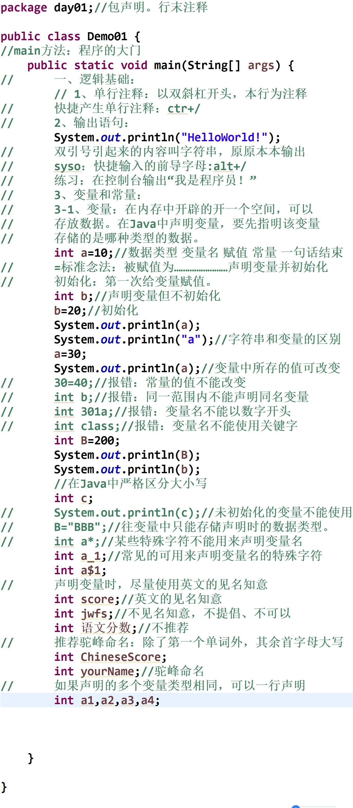

# java 学习纪录

### 一、:Java语言发展史(了解)

1. Java之父

		《Java》之父——詹姆斯·高斯林
		
2. JDK的版本

        JDK 14
        JDK 13
        JDK 12
        JDK 11
        JDK 10
        JDK 9
        JDK 8
        JDK 7
        JDK 6
        JDK 5
        JDK 1.4
        JDK 1.3
        JDK 1.2
        JDK 1.1
        JDK 1.0
	[参考链接](https://blog.csdn.net/hzzhu039/article/details/105719212?utm_medium=distribute.pc_relevant.none-task-blog-BlogCommendFromMachineLearnPai2-3.nonecase&depth_1-utm_source=distribute.pc_relevant.none-task-blog-BlogCommendFromMachineLearnPai2-3.nonecase)
	
3. Java语言的平台

            JavaSE
            JavaEE
            JavaME(Android)
	  [参考链接](https://www.oracle.com/java/technologies/oracle-java-archive-downloads.html)
	    
4. Java语言的特点

		- JDK,JRE,JVM(掌握)

			(1)JVM
				保证Java语言跨平台。针对不同的操心系统提供不同的JVM。
				问题：java语言是跨平台的吗?JVM是跨平台的吗?
				答案：Java是跨平台的，不同的平台有不同版本的JVM

			(2)JRE
				java程序的运行环境。包括JVM和核心类库

			(3)JDK
				java开发环境。包括JRE和开发工具(javac,java)

		- JDK的下载，安装，卸载(掌握)

			(1)下载
				到官网下载，或者百度也可以。
			(2)安装
				安装版 安步骤一步步安装即可。开发工具一般建议不要有空格和中文。
				绿色版 解压就可以使用
			(3)卸载
				安装版 通过360或者控制面板
				绿色版 直接删除文件夹即可

		- HelloWorld案例(掌握)

			(1)写程序
				class HelloWorld {
					public static void main(String[] args) {
						System.out.println("HelloWorld");
					}
				}
			(2)解释该程序
				A:class是用来定义类的，格式是: class 类名 {}
				B:程序要独立运行，必须有主方法，格式是：
					public static void main(String[] args) { }
				C:程序要输出内容，必须有输出语句，格式是：
					System.out.println("HelloWorld");
			(3)程序的编译和运行
				A:javac命令编译程序，后面跟的是文件名称
					javac HelloWorld.java
				B:java命令执行程序，后面跟的是class文件名称，不含扩展名
					java HelloWorld
			(4)一个Java程序的开发流程
				A:编写Java源程序
				B:通过javac命令编译java程序，生成字节码文件
				C:通过java命令运行字节码文件

		- :HelloWorld案例常见问题(理解)

			(1)文件名和类名可以不一致，但是建议一致
			(2)找不到文件
			(3)单词写错误(包括大小写，拼写)
			(4)括号匹配问题，建议大家写程序的时候，成对写括号
			(5)中英文问题，java程序一般都是英文状态的
			(6)末尾缺少分号		

		- path环境变量(理解)

			(1)为什么要配置path环境变量
				为了让javac和java命令可以在任意目录下使用
			(2)如何配置
				A:方式1 直接修改path，在前面追加JDK的bin目录
				B:方式2(掌握) 
					新建JAVA_HOME: JDK的安装目录
					修改path: %JAVA_HOME%\bin;后面是以前的环境变量

		-	classpath环境变量(理解)

			(1)为什么要配置classpath环境变量
				为了让class文件可以在任意目录下运行
			(2)如何配置
				新建：classpath，把你想要在任意目录下运行的class文件所在目录配置过去即可。
				注意：将来在执行的时候，有先后顺序关系
			(3)path和classpath的区别
				path是为了让exe文件可以在任意目录下运行
				classpath是为了让class文件可以在任意目录下运行

		-	注释(掌握)

			(1)注释:用于解释说明程序的文字
			(2)分类：
				A:单行：//注释文字
				B:多行：/* 注释文字 */
				C:文档注释：/** 注释文字 */
			(3)带注释的HelloWorld案例
			(4)注释的作用：
				A:解释说明程序，提高程序的阅读性
				B:帮助我们调试程序

		-	关键字(掌握)

			(1)关键字:被Java赋予特定含义的单词
			(2)特点:全部小写
			(3)注意事项：
				A:goto和const作为保留字存在，目前不使用
				B:类似于Editplus这样的高级记事本，会对关键字有特殊颜色标记，方便记忆

		-	标识符(掌握)

			(1)标识符：给类，接口，方法或者变量起名字的符号
			(2)组成规则：
				A:英文字母大小写
				B:数字
				C:_和$
			(3)注意事项：
				A:不能以数字开头
				B:不能是Java中的关键字
				C:区分大小写
					Student,student 这是两个名称
			(4)常见命名方式：
				A:包 其实就是文件夹,用于解决相同类名问题
					全部小写
					单级：com
					多级：cn.itcast

				B:类或者接口
					一个单词：首字母大写
						Student,Person,Teacher
					多个单词：每个单词的首字母大写
						HelloWorld,MyName,NameDemo

				C:方法或者变量
					一个单词：全部小写
						name,age,show()
					多个单词：从第二个单词开始，每个单词首字母大写
						myName,showAllStudentNames()

				D:常量
					一个单词：全部大写
						AGE
					多个单词：每个单词都大写，用_连接
						STUDENT_MAX_AGE

					int a = 5;
					int b = ~a;

                
