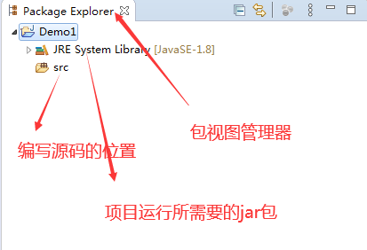

# 第一天_入门：

## 1.JDK、JRE、JVM的区别和联系

> JDK:
> Java Development Kit
> 是Java语言开发工具包,提供了三千多个类库
> JRE:
> Java Runtime Environment
> 是运行Java程序所必须的环境集合,如果你需要运行java程序，就得安装jre，
> 如果你不做java开发，那么安装jre就可以了
> JVM：
> Java Virtual Machine
> 解释运行Java字节码文件，跨平台的核心

==联系：JDK 包含JRE，JRE包含JVM。==

## 2.安装jdk：

1.


2.先新建安装jdk和jr的空文件夹目录


3.


4.


5.安装成功，显示如图：


jdk的组件大概如下图：


功能如下：

```javascript
javac – 编译器，将源程序转成字节码
jar – 打包工具，将相关的类文件打包成一个文件
javadoc – 文档生成器，从源码注释中提取文档
jdb – debugger，查错工具
java – 运行编译后的java程序（.class后缀的）
appletviewer：小程序浏览器，一种执行HTML文件上的Java小程序的Java浏览器。
Javah：产生可以调用Java过程的C过程，或建立能被Java程序调用的C过程的头文件。
Javap：Java反汇编器，显示编译类文件中的可访问功能和数据，同时显示字节代码含义。
Jconsole: Java进行系统调试和监控的工具
JRE - java程序运行环境
```


## 3.配置环境变量

### a.环境变量作用

```java
path（环境变量）是dos以前的内部命令，windows继续沿用至今。用作运行某个命令的时候，本地查找不到某个命令或文件，会到这个声明的目录中去查找；
配置环境变量的目的是为了让window程序能够通过path目录去找到运行的指令目录。
```

### b.配置步骤：

1.	计算机点击右键 ->属性-->高级系统设置-->环境变量
2.	新建系统变量，设置一个JAVA_HOME目录，注意不要去设置用户变量，如果设置的是用户变量只是针对该用户生效

  

配置Java_home变量名的好处是，在后期我们改变了jdk的安装位置，我们只要改java_home变量名的值就可以了，比较方便。

3.配置path里面的值：%JAVA_HOME%\bin;就可以找到D:\java8\java1.8_jdk\bin;目录下的指令了


==这样就安装成功了！==

如何去测试你自己安装的jdk成功了呢？

==可以去通过dos命令运行jdk的bin目录的命令试试看，如果运行不了就说明windows系统没有通过path环境变量找到你安装的jdk的bin目录下的指令==。

如图：


那如果是安装了jdk并且配置了环境变量，那么windows就能够通过path找到你安装的jdk位置bin目录下的指令：

==比如：运行一个java指令，现在没有报“不是内部内部或外部命令，也不是可运行的程序”就说明现在可以windows可以通过在环境变量中配置的path路径找到你的jdk安装位置的java指令了！==


常见的dos命令：

https://blog.csdn.net/qq_37131111/article/details/82079083

## 4.安装Eclipse

a.下载Eclipse

https://www.eclipse.org/downloads/

1.


2.


3.

==注意：如果你的jdk是64位的你就安装64位的eclipse，如果是32位就安装eclipse32位==


4.下载后打开:


设置一个快捷键到桌面去，直接双击能够打开。

5.


## 5.开发项目

1.左上角File->New->Java Project 新建java项目


 2.


3.




4.


【**新手入坑**】

Java区分大小写：标点符号都是英文的,因为的结束符号是;不是句号

 java有一些规范，项目名、类名一般都是英文并且第一个字母大写


## 6.改字体大小


一般改成16px即可。

## 7.程序的开发步骤

```java
1.编写源代码，编写XXX.java文件
2.编译源文件,把XXX.java翻译成XXX.class字节码文件
3.运行，JVM运行的是XXX.class文件    
```


## 8.注释

通常我们后期项目代码量越来越多，为了方便自己或者同事能够看懂代码，就需要添加注释对代码进行说明解释。

==注释后的代码不会被编译，因此还可以将作废但需要保留在文件中的代码注释掉。==

### 注释分类：

#### a.文档注释

```java
/**
 * 文档注释 一般用于类上面对整个类进行说明
 * 还可以在方法上对方法说明
 * @author Administrator
 *
 */
public class Day02 {
public static void main(String[] args) {
```

#### b.单行注释

```java
//单行注释，一般用于对一行进行说明
```

#### c..多行注释

```java
/*
 * 
 * 多行注释：用于给多行进行注释
 */
```


# 第二天_变量：

## A.定义

```java
变量本质上是在计算机内存中代表一个“可操作的存储空间”,空间位置是确定的，但是里面存放的值是不确定的，可以通过
变量名来访问“对应的空间”,从而操作这个“存储空间”存储的值。   
```

【字节】：

```java
字节是内存中最小的存储单位，一个字节byte由8位组成，8个bit
```

==java是一个强类型语言，每个变量都必须声明其数据类型，变量的数据类型决定了变量占据存储空间的大小。==

==比如：int a=10;表示表a的空间大小4个字节。==


【数据类型】：

```java
int是一个数据类型，依据int就能够开辟4个字节的内存空间，用以用于存放整数
```

## B.变量类型：

```java
变量类型分为基本类型和引用类型
```

## C.变量种类：

### 1.局部变量:

在方法或语句块内部定义的变量，叫局部变量。生命周期是从声明位置开始到方法或语句块执行完毕为止。局部变量必须先声明再赋值后使用。

### 2.成员变量：

也叫实例变量，方法外部、类内部定义的变量，叫做全局变量，作用域是整个类中，从属于对象，生命周期伴随对象始终。如果不自行初始化，他会自动初始化成该类型的默初始值。


### 3.静态变量：

也叫类变量，使用static修饰，从属于类，生命周期伴随类始终，从类加载到卸载。


## D.变量三步骤：

1.声明

2.赋值

3.使用

```java
//1.声明变量  根据数据的大小依据数据类型int在内存中开辟一个能存放整数的空间	（4个字节）
	int a;
	//2.赋值  把整数10通过=号把右边的值赋值给左边的变量名（因为需要通过变量名就是内存地址找到内置中存放的10）
	a=10;
	//3.使用  使用变量里面的值进行计算
	a=a+5;
    System.out.println(a);
```

==还可以声明并且赋值：==

```java
	//声明并且赋值
//	int a=10;
//	int a,b,c=10;//不建议使用
	int a=10,b=5,c=8;//不建议使用	
	//3.使用  使用变量里面的值进行计算
	a=a+5;
    System.out.println("a的值是:"+a+",b的值是:"+b);
```


## E.常见错误


## F.程序调试：

#### a.调试的作用：

```java
当程序的流程越来越复杂，我们想要看到代码如何一行一行的去执行的，那么我们就需要学会如何去进行调试
调试目的有两个：
    1.让自动执行的代码变成手动模式一步一步的去执行，看到程序运行的步骤
    2.可以监视内存中变量的值如何发生改变
```

#### b.调试步骤：

> 1.打断点，自动执行的代码遇到断点就会停住，开始手动执行
>
> 2.debug as 调试模式启动
>
> 3.F6，手动执行代码，观察变量里面的值如何发生改变
>
> 4.如果需要将手动执行的代码变成自动执行，可以按F8变成自动执行
>
> 


## G.数据类型：


### a.基本数据类型

八个基本数据类型：

```java
	 byte num1=125;//-128-127 整型  1个字节
//	 short num2=32767; //整型 2个字节
	 int age=21;//整型      4个字节
	 Long money=3232323238343434L;//长整型 8个字节
	 char sex='男';//字符类型  2个字节
	 float fenshu1=98.6f;//单精度浮点型  4个字节
	 double fenshu2=98.567;//双精度类型  8个字节   
	 boolean hege=true;//布尔类型 只能存放true/false 1个bit(1个比特至少也要1个字节存)
```

```java
String name="张三";//字符串类型 8个字节
```

**整型的取值范围：**


**Java语言整型的四种表现形式**

十进制：如99，-500，0   （一般默认用十进制）

八进制：要求以0开头，如015

十六进制：要求0x或0X开头，如0x15

二进制数：要求0b或0B开头，如0b01110011

java语言的整型常数默认为int类型，声明long型常量可以在值后加‘l’或‘L’。

**【举例】**

```java
public static void main(String[] args) {
	//测试整型变量
	int a=15;
	int b=015;//以0开头是八进制
	int c=0x15;//以0x开头是16进制
	int d=0b1101;//以0b开头的是二进制
	
	System.out.println(b);//八进制 13
	System.out.println(c);//十六进制 21
	System.out.println(d);//二进制13
	
	byte age=20;//值的范围是-128 -127
//	byte age2=300;
	int population=2000000000;
	//整型常量默认是int类型，声明long型常量可以在值后加‘i’或‘L’
	long globalPopulation=7400000000L;		
	}
```


【注意】

==String是一个特殊的引用数据类型==


### b.引用数据类型

引用数据类型：类（class）、接口、数组。用于存储对象的引用，存储空间占用4个字节。


## H.浮点类型：

==浮点类型不是精确的数==！float类型又被称为单精度类型，尾数可以精确到7位有效数字,在很多情况下，float类型的精度很难满足需求。而double表示这种类型的数值精度约是float类型的两倍，又被成为双精度类型，绝大部分应用程序都采用double类型，java默认的浮点类型就是double。


> java浮点类型常量有两种表示形式：
>
> 十进制数形式:例如:3.14     314.0      0.314
>
> 科学记数法形式,如314e2  314E2  314E-2   
>
> （注明：科学计数法中E2代表10的2次方，比如314*100，314E-2代表乘以10的-2次，表示314除以100）  
>


【**老鸟建议**】

用float或double去做金额这种精确计算不合适，在java.math包下提供了BigInteger和BigDecimal用于处理任意长度的数值。BigInteger实现类任意精度的整数运算，BigDecimal实现任意精度的浮点运算。比如银行的金额运算，就建议用BigDecimal实现。

```java
public static void main(String[] args) {
	//用float或double去做金额这种精确计算不合适，在java.math包下提供了BigInteger和BigDecimal
	//用于处理任意长度的数值
	 BigDecimal  bd=BigDecimal.valueOf(1.0);
	 //求差
	 bd=bd.subtract(BigDecimal.valueOf(0.1));
	 bd=bd.subtract(BigDecimal.valueOf(0.1));
	 bd=bd.subtract(BigDecimal.valueOf(0.1));
	 bd=bd.subtract(BigDecimal.valueOf(0.1));
	 bd=bd.subtract(BigDecimal.valueOf(0.1));
	 System.out.println(bd);//结果0.5
	 System.out.println(1.0-0.1-0.1-0.1-0.1-0.1);//结果是0.5000000000000001
	 
	 BigDecimal bd2=BigDecimal.valueOf(0.1);
	 BigDecimal bd3=BigDecimal.valueOf(1.0/10.0);
//	 System.out.println(bd2.equals(bd3));
//	 System.out.println(bd3);
//	 System.out.println(1.0/10.0);
```


**字符型变量/常量**

字符型在内存中占2个字节，在java中使用单引号来表示字符常量。例如'A'是一个字符，它与"A"是不同的，"A"表示含有一个字符的字符串。

 char类型用来表示在Unicode编码中的字符。Unicode编码被设计用来处理各种语言的文字，它占2个字节，可允许有65536个字符。

**【字符举例】**

```java
char eChar='a';
char eChar='中';
```

Unicode具有从0到65535之间的编码，他们通常从’\u0000‘到 ’\uFFFF‘之间的十六进制值来表示(前缀为u表示Unicode)。

【示例】

字符型的十六进制值表示方法

```java
char c='\u0061';//代表a
```

**转义字符：**

java语言还允许使用转义字符  ’\‘ 来将其后的字符转变为其他的含义。比如用\t就可以代表\u0009这样很好记。

常用的转义字符及其含义和Unicode值下表所示：

| 转义字符 |                 |           |
| -------- | --------------- | --------- |
| 转义符   | 含义            | Unicode值 |
| \b       | 退格(backspace) | \u0008    |
| \n       | 换行            | \u000a    |
| \r       | 回车            | \u000d    |
| \t       | 制表符(tab)     | \u0009    |
| \”       | 双引号          | \u0022    |
| \’       | 单引号          | \u0027    |
| \\       | 反斜杆          | \u005c    |

【代码演示：】

```java
	String str1="你好\n世界";
	String str2="你好\t世界";
	String str3="你好\'世界";
	String str4="你好\\世界";
	String str5="你好\u0009世界";
	System.out.println(str1);
	System.out.println(str2);
	System.out.println(str3);
	System.out.println(str4);
	System.out.println(str5);
```


## I.变量的命名规则：


> 记住：不要花里花哨，不要abcd,不要关键字
>
> 起名字一定要有含义，让自己和别人能够看得懂，比如姓名定位name,哪怕xingming中国程序员能看懂。
>
> num1、num2
>
> 如果是多个单词组成的，比如myScore；第二个单词首字母大写，驼峰命名法。


## G.数据类型转换：

### a.自动类型转换

```java
小的空间里面的数据放到大的空间里面去，能放下，叫自动类型转换
```

### b.强制类型转换

```java
大的空间的数据放到小的空间里面，放不下，需要强制类型转换，但是会丢失精度，把整数后不要了!
```


```java
           int a=10;
			//小的空间里面的数据放到大的空间里面去，能放下，叫自动类型转换
			double b=a;//自动类型转换
			double c=9.8;
			// cannot convert from double to int
			//大的空间的数据放到小的空间里面，放不下，需要强制类型转换，但是会丢失精度，把整数后不要了!
			int d=(int) c;
			System.out.println("a："+a+" b:"+b+" d:"+d);
			//怎么把123变成String最简单
//			String str=123+"";
```

## K.控制台输入：

```java
package test2;

import java.util.Scanner;//导包

/**
 * 控制台输入
 * @author Administrator
 *
 */
public class Day03 {
	public static void main(String[] args) {
		
//	 String name="张三";
//	 int age=21;
	 //创建输入对象input
	 Scanner input=new Scanner(System.in);
	 System.out.println("请输入您的姓名:");
	 //姓名
	 String name=input.next();
	 System.out.println("请输入您的年龄：");
	 //年龄
	 int age=input.nextInt();
	 System.out.println("请输入性别:");
	 char sex=input.next().charAt(1);//取字符第1个字符  1代表第二个  
	 System.out.println("你好，我是"+name+"，性别："+sex+",今年"+age+"岁了！");
	}
}

```


## L.运算符：

### a.算术运算符

```java
+ - * / %
```

```java
int a=7;
		int b=3;
		double c=3.0;
		int jia=a+b;
		int jian=a-b;
		int cheng=a*b;
		int chu=a/b;
		//小的值和大的运算，先会把小的换算成大的类型再去和大的  7.0/3.0
		//7/3和7/3.0结果是不一样的！
		double chu2=a/c;
//		int quyu=a%b;
		int qy2=8/3;//结果值是2
//		System.out.println(quyu);
```


### b.逻辑运算符

```java
并且  && 
或者  || 
非    ！  取反的意思     
```

条件1&&条件2 都同时满足为true，返回结果true

false&&true   -->返回false

false&&false -->返回false

条件1||条件2 只要有一个满足true，返回结果true

true||false --》true

false||false -->false


【**面试题**】

```java
&和&&的区别？|和||的区别？
答：&&具有短路功能，比如  条件A&&条件B，条件A和条件B同时满足true返回结果为true，当条件A已经得到结果是false了那么条件B就没有必要去比了，这就是短路功能，因此效率更高。&就必须将条件A和条件B都去比较效率低    
    
```


### c.条件运算符

```java
a>b
a<b
a>=b
a<=b
a==b
a!=b    
条件运算符也可以比较运算符，得到结果是bolean类型，也就true或者false    
```

```java
	int a=7;
	int b=7;
	System.out.println(a==b);
	System.out.println(a>=b);
	System.out.println(a!=b);
```


### d.赋值运算符

```java
= 赋值运算符 把右边的值通过=赋值运算符赋给左边的变量
int a=10;  
```

### e.位运算符

```java
	System.out.println(12<<3);
	System.out.println(2>>3);
```

### f.三目运算符

```java
  //类似于if结构，？前面的做比较，如果比较结果是true就把:前面的1赋值给a,否则把:后面的5赋给a	
	int a=7>8?1:5;
	System.out.println("a:"+a);
		
	String str=9>8?"帅哥":"妹子";
	System.out.println(str);
```


## S.==比较

```java
	int a=7;
	int b=7;
	System.out.println(a==b);//true
```

> ==等号用于数值之间的比较，比较的是内存地址；当int a=7;的时候会去内存中找是否有7，如果没有就开辟一个4个字节的内存空间a把7放进去；第二次int b=7；的时候也要去内存中找是否有7，那如果有7就无需再去开辟新的内存空间造成浪费，就将存7的空间的地址赋给b,因此a的内存地址和b的内存地址是同一个，所以值应该也是同一个！

字符串的比较用equals（）,后期讲。


## T.常量：

常量通常指的是一个固定的值，例如：1、2、3、'a'、‘b’、‘c’、true、false、'zhangsan'等。

在java语言中，主要是利用关键字final来定义一个常量。常量一旦初始化后不能再更改其值。

**定义常量的格式：**

```java
final type varName=value;
```

```java
	int age=18;
	final String name="zhangsan";
//	name="lisi";//定义成常量就不能再被修改
```

常量的定义规则：一般定义成大写，比如NAME, 或者YOUR_NAME。

## U.上机案例1

```java
public static void main(String[] args) {
	Scanner input=new Scanner(System.in);
	System.out.println("请输入4位长度的整数:");
	//会员号
	int num= input.nextInt();
	//1234 
	int gewei=num%10;
	int shiwei=num/10%10;
	int baiwei=num/100%10;
	int qianwei=num/1000;
	//统计出各位数的和
	int sum=gewei+shiwei+baiwei+qianwei;
	System.out.println("会员卡号:"+num+"各位之和："+sum);
	//判断会员号之和大于20就返回true
	boolean flag= sum>20;
	System.out.println("是幸运客户吗?:"+flag);
```


## V.上机案例2

```java
public class Day02 {
	public static void main(String[] args) {
	//控制台输入语文、数学、英语的成绩，总成绩和平均分
	Scanner input=new Scanner(System.in);
	System.out.print("请输入语文成绩:");
	int yuwen=input.nextInt();
	System.out.print("请输入数学成绩:");
	int shuxue=input.nextInt();
	System.out.print("请输入英语成绩:");
	int yingyu=input.nextInt();
	//累加总分
	int sumScore=yuwen+shuxue+yingyu;
	//计算平均分
	double avgScore=sumScore/3.0;
	System.out.println("总分成绩:"+sumScore+",平均分:"+avgScore);
	
	}
}
```

# 第三天_选择结构

## A.定义

```java
用于选择和判断，进行流程控制。
```

## B.选择结构分类：

### a.if结构

#### 1.简单if结构 

​      用于简单的判断

```java
       int money=20;
		if(money>100) {
			System.out.println("吃肯德基！");
		}else{
			System.out.println("吃南昌拌粉！");
		}
```


#### 2.else if多重if结构

多重选择但是只会选择一种的情况下使用

```java
package day02;

import java.util.Scanner;

/**
 * 控制台输入分数
 * 如果分数大于90分，奖励兰博基尼
 * 如果大于等于80分，奖励保时捷
 * 如果大于60分 ，奖励大众
 * 低于60分，不奖励
 * 
 *
 */
public class Day01 {
	public static void main(String[] args) {
	Scanner input=new Scanner(System.in);
	System.out.println("请输入分数:");
	int score=input.nextInt();
	//多重if结构，多重选择但是只会选择一种的情况下使用
	if(score>90){
		System.out.println("奖励兰博基尼一台");
	}else if (score>=80) {
		System.out.println("奖励保时捷一台");
	}else if (score>=60) {
		System.out.println("奖励大众");
	}else{
		System.out.println("不奖励");
	}
	
	}
}

```


#### 3.嵌套if结构

用于复杂的判断，  先满足外层的if结构条件，再去执行内存if结构

```java
package day02;

import java.util.Scanner;

/**
 * 输入星期   一 二等
 * 
 * 如果星期1 :吃炒粉
 * 如果星期2  :吃沙县料理
 * 如果星期3  :吃兰州料理
 * 如果星期4、5:吃盖饭
 * 其他时间吃肯德基
 * 判断如果不是1-7之间的数，就提示输入星期错误
 * 
 * 
 *
 */
public class Day02 {
	public static void main(String[] args) {
		Scanner input=new Scanner(System.in);
		System.out.println("请输入星期：");
		int week=input.nextInt();
		//嵌套if结构  用于复杂的判断，  先满足外层的if结构条件，再去执行内存if结构
		if (week>=1&&week<=7) {
			if (week==1) {
				System.out.println("星期一吃炒粉");
			}else if (week==2) {
				System.out.println("星期二吃沙县小吃");
			}else if(week==3) {
				System.out.println("星期三吃兰州拉面");
			}else if(week==4||week==5){
				System.out.println("星期四和星期五都盖饭");
			}else {
				System.out.println("其他时间吃肯德基");
			}
		}else {
			System.out.println("输入错误，请输入合法的星期");
		}	
	}
}

```


### b.switch结构

就是用来替代else-if多重结构的，作用一致，都是用于多种选择但只选择一种。

```java
 Scanner input=new Scanner(System.in);
	 System.out.print("请输入星期:");
	 char week=input.next().charAt(0);
	 switch(week) {
	 case '一':
		 break;
	 case '二':
		 System.out.println("星期二吃DKS");
		 break;	 
	 case '三':
	 case '四':
		 System.out.println("星期三、四吃MDL");
		 break;
	default:
		System.out.println("其他时间吃盖饭");
		break;
	 }
```


【**else -if和switch的区别？**】

```java
switch只能用于等值判断，而else-if可以用于等值判断也能用于区间判断。
```

==switch中表达式的类型只能是:int、char、String类型==

【问题】

switch能不能嵌套？

```java
可以switch嵌套switch，但是这些写太乱不建议这样写，建议switch嵌套if结构
```


```java
Scanner input=new Scanner(System.in);
	 System.out.print("请输入星期:");
	 char week=input.next().charAt(0);
	 char sex='男';
	 switch(week) {
	 case '一':
		 System.out.println("星期一吃肯德基");
		 if (sex=='男') {
			System.out.println("男的吃肯德基打八折");
		}else {
			System.out.println("女的吃肯德基免费！");
		}
		 break;
	 case '二':
		 System.out.println("星期二吃DKS");
		 break;	 
	 case '三':
	 case '四':
		 System.out.println("星期三、四吃MDL");
		 break;
	default:
		System.out.println("其他时间吃盖饭");
		break;
	 }
```


## C.==和equals区别

== 是数值之间的比较，比较的内存地址，char类型也是用 == 比较，比如sex=='男'。

equals()是字符串之间的比较，比较的是两个值是否相等，比如   "男生".equals(sex），注意一定要把“男生”值放前面，防止空指针异常。

```java
//	char sex='女';
//	if(sex=='男'){
//		System.out.println("去男厕所");
//	}else {
//		System.out.println("去女厕所");
//	}
	Scanner input=new Scanner(System.in);	
	String sex=input.next();
//	if("男生".equals(sex)){
//		System.out.println("男神去男厕所");
//	}else {
//		System.out.println("女生去女厕所");
//	}
	if(!"男生".equals(sex)){
		System.out.println("女生去女厕所");
	}else {
		System.out.println("男生去男厕所");
	}
```


## D.随机数：

a.Math类

```java
	//生成随机数
  	//0-1之间的小数   0.1 0.9
	//随机生成1-10
	 int num=(int)(Math.random()*10)+1;	
	 System.out.println(num);
```

b.Random类


# 第四天_循环结构：

## A.定义：

==循环：在特定的条件下重复的去做一件事情。==


## B.循环种类：

### 1.while循环

```java
先判断，后执行。先判断条件是否满足，如果条件满足为true就执行循环体内的代码，否则不执行。			
```

```java
	//循环必要条件： 1.起始值 2.循环条件 3.循环体（满足条件执行的代码）4.迭代
	int i=1;
	while(i<=10){
		System.out.println("我很帅第"+i+"遍");
		i++;
	}
```


### 2.do-while循环

```java
先执行，后判断。先不管条件是否成立都先执行一遍，再去判断是否需要循环，如果条件满足为true就执行循环体内的代码，否则不执行。
```

```java
/**
 * 不管你是否合格都练习前代码一次，再去判断是否合格
 * 如果成绩不合格就需要再一次练习敲代码一次，知道合格为止
 * do-while特征：先执行，后判断。不管条件是否成立，至少会执行一次
 *
 */ 
public static void main(String[] args) {
	Scanner input=new Scanner(System.in);	
	String answer;	
	do {
		System.out.println("练习敲代码一遍！");
		System.out.println("是否合格?(y/n):");
		answer=input.next();
	}while("n".equals(answer));	
	
	System.out.println("及格了不需要练习了！");
}
```


### 3.for循环

```java
在知道循环次数的情况下使用
```

```java
	//循环1-100
   for(int i=1;i<=100;i++){
		System.out.println(i);
	}		
    //1-100偶数的和
	int total=0;	
    for(int i=1;i<=100;i++){
    	if (i%2==0) {
			total+=i;
		}
    }
	System.out.println("1-100偶数之间的和是:"+total);	
```


### 4.foreach循环


## C.跳转语句

### 1.break

```java
中断的意思，遇到break跳出循环语句结束循环
```

```java
	for (int i = 1; i <=10; i++) {
		if (i==5) {
		break;//遇到break直接跳出循环语句结束循环
		}
		System.out.println(i);
	}
//结果:1 2 3 4 
```


### 2.continue

```java
继续的意思，遇到continue，continue后面的代码不执行，直接继续执行下一次循环
```

```java
	for (int i = 1; i <=10; i++) {
		if (i==5) {
			continue;//遇到continue后面代码不执行，直接继续下一次循环
		}
		System.out.println(i);
	}
//结果: 1 2 3 4  6 7 8 9  10
```


### 3.return

```java
用于方法内部返回结果值,也会提前结束循环返回结果
```

```java
public boolean login(String name,int pwd){
		for (int i = 0; i < names.length; i++) {
			if (names[i].equals(name)&&passwords[i]==pwd) {
				return true;//返回结果，结束循环
			}
		}
		return false;
	}
```


#### 案例1：

```java
Scanner input=new Scanner(System.in);	
	boolean jixu=true;//标识是否继续
	do {
		System.out.println("***********************");
		System.out.println("1.订单管理");
		System.out.println("2.客户管理");
		System.out.println("3.销量管理");
		System.out.println("4.库存管理");
		System.out.println("5.退出系统");
		System.out.println("***********************");
		System.out.println("请输入选项:");
		int num=input.nextInt();
		switch (num) {
		case 1:
			System.out.println(">>订单管理");
			break;
		case 2:
			System.out.println(">>客户管理");
			break;	
		case 3:
			System.out.println(">>销量管理");
			break;
		case 4:
			System.out.println(">>库存管理");
			break;
		case 5:
			jixu=false;//标识不继续
			System.out.println(">>退出系统");
			break;	
		default:
			System.out.println("选择错误，请重新输入!");
			break;
		}
	} while (jixu==true);
	System.out.println("系统已退出，欢迎下次光临!");
```

#### 案例2：

```java
Scanner input=new Scanner(System.in);	
	do {
		System.out.println("***********************");
		System.out.println("1.订单管理");
		System.out.println("2.客户管理");
		System.out.println("3.销量管理");
		System.out.println("4.库存管理");
		System.out.println("5.退出系统");
		System.out.println("***********************");
		System.out.println("请输入选项:");
		int num=input.nextInt();
		switch (num) {
		case 1:
			System.out.println(">>订单管理");
			continue;
		case 2:
			System.out.println(">>客户管理");
			continue;	
		case 3:
			System.out.println(">>销量管理");
			continue;
		case 4:
			System.out.println(">>库存管理");
			continue;
		case 5:
			System.out.println(">>退出系统");
			break;//跳出switch结构
		default:
			System.out.println("选择错误，请重新输入!");
			continue;
		}
		break;//跳出循环结构
	} while (true);
	System.out.println("系统已退出，欢迎下次光临!");
```

#### 案例3：

```java
Scanner input=new Scanner(System.in);	
	//注册用户名密码	
	String userName="zhangsan";
	int userPwd=12345;
	boolean flag=false;//标识是否登录成功
	for(int i=2;i>=0;i--){
		System.out.print("请输入用户名：");
		String inputName=input.next();
		System.out.print("请输入密码：");
		int inputPwd=input.nextInt();
		if (inputName.equals(userName)&&inputPwd==userPwd) {
			flag=true;//标识登录成功
			break;//提前结束循环
		}
		System.out.println("用户名或密码错误,还有"+i+"次机会");
	}
	
	if (flag) {
		System.out.println("登录成功，欢迎您"+userName);
	}else {
		System.out.println("很遗憾，没有登录成功！");
	}
```


# 第五天_数组：

## A.定义

> 数组就是一组数，开辟一组有序的空间存值，并且空间个数有限。


## B.定义数组步骤：

1.声明

```java
int a[];//在栈内存中用于存放数组在堆内存中的地址
```

2.开辟空间

```java
a[]=new int[5];//在堆内存开辟空间，将堆内存的地址赋给a,a保存在栈内存
```

3.赋值

```java
a[0]=100;//将100放到a指定的堆内存的第一个空间中
```

4.使用

```java
a[0]=a[0]*10;//使用数组下标里面的值
```

```java
       int a=10;
		//定义数组并且初始化值
		int b[]=new int[]{90,87,90,8,4}; 
		
		System.out.println("数组长度:"+b.length);
		for(int i=0;i<b.length;i++){
			System.out.println(b[i]);			
		}
```


### 常见错误：


## C:数组初始化

```java
		//方式1 定义数组并且初始化值
		int b[]=new int[]{90,87,90,8,4};
		//方式2 定义数组并且初始化值
		int b[]={90,87,90,8,4};
		//下面会报错，声明和初始化必须在一行
//		int c[];
//		c[]=new int[]{90,87,90,8,4};
```


## D:foreach遍历数组

```java
	//foreach或者叫加强for循环
	//注意：foreach用于数组的和集合的遍历（取值）
   int score[]={43,43,5,54,6};
	for (int a : score) {
		System.out.print(" "+a);
	}
```

## E:空指针异常


## F.数组上机练习

### 练习1：

```java
/**
 * 控制台输入5个人的成绩，得到平均分
 * @author Administrator
 *
 */
public class Day04 {
  public static void main(String[] args) {
	Scanner input=new Scanner(System.in); 
	int score[]=new int[5];
	int sum=0;//统计总分
	for (int i = 0; i < score.length; i++) {
		System.out.println("请输入第"+(i+1)+"个学生的成绩：");
		score[i]=input.nextInt();
		sum=sum+score[i];
	}
	System.out.println("*********************************************");
	for (int i = 0; i < score.length; i++) {
		System.out.print(" "+score[i]);
	}
	System.out.println("\n*********************************************");
	//foreach或者叫加强for循环
	//注意：foreach用于数组的和集合的遍历（取值）
	for (int a : score) {
		System.out.print(" "+a);
	}
	System.out.println("\n*********************************************");
	//得到平均分
	double avg=sum/score.length;
	System.out.println("5个人的平均分是:"+avg);
```


### 练习2：

```java

//控制入输入6个人的姓名
//再输入一个需要找的姓名，如狗剩
//得到结果是否找到该人	

public class Day05 {
	public static void main(String[] args) {
	Scanner input=new Scanner(System.in);	
	//定义6个长度的数组	
	String []names=new String[6];
	boolean flag=false;//标识是否找到
	for (int i = 0; i < names.length; i++) {
		System.out.print("请输入第"+(i+1)+"个姓名:");
		names[i]=input.next();
	}
	for (String name : names) {
		System.out.print(" "+name);
	}
	//查找
	System.out.println("\n请输入需要查找的姓名:");
	String findName=input.next();
	
	//方式1
	for (int i = 0; i < names.length; i++) {
		if (names[i].equals(findName)) {
			flag=true;//标识找到了
			break;//结束循环
		}
	}
//	//方式2
//	for (String name : names) {
//		if (name.equals(findName)) {
//			flag=true;//标识找到了
//			break;//结束循环
//		}
//	}
	
	if (flag) {
		System.out.println("找到了"+findName);
	}else {
		System.out.println("抱歉,没有找到"+findName);
	}
	}	
}
```

### 练习3：

```java
public static void main(String[] args) {
	Scanner input=new Scanner(System.in);	
	String books[]=new String[6];
	books[0]="三国演义";
	books[1]="西游记";
	books[2]="琅琊榜";
	//控制入输入一本书名，插入到空的位置
	System.out.println("请输入需要插入的书名:");
	String newBook=input.next();
	//循环遍历找到null位置
	for (int i = 0; i < books.length; i++) {
	  if (books[i]==null) {
		  books[i]=newBook;
		  break;//跳出循环
	  }
	}
	System.out.println("********************************");
	for (String book : books) {
		if (book!=null) {
			System.out.print(" "+book);
		}
	}
		
	}
```

### 练习4：

```java
	Scanner input=new Scanner(System.in);	
	String books[]=new String[6];
	books[0]="三国演义";
	books[1]="西游记";
	books[2]="琅琊榜";
	
	boolean isFind=false;//标识是否找到该书名
	
	for (String book : books) {
		if (book!=null) {
			System.out.print(" "+book);
		}
	}
	
	//控制台输入一本书名，插入到空的位置
	System.out.println("\n请输入需要修改的书名:");
	String findBook=input.next();
	//循环遍历找到null位置
	for (int i = 0; i < books.length; i++) {
		//判断books[i]里面是否有值，不然值为null引发空指针异常
	  if (books[i]!=null) {
		  if (books[i].equals(findBook)) {
			  isFind=true;
			  System.out.println("输入新的书名:");
			  String newBook=input.next();
			  books[i]=newBook;
			  break;//跳出循环
		  }
	 }
	}
	if (!isFind) {
		System.out.println("很遗憾，没有该书名！");
	}else {
		System.out.println("***************修改后的图书列表*****************");
		for (String book : books) {
			if (book!=null) {
				System.out.print(" "+book);
			}
		}
	}
	
	}
```

### 练习5：

```java
Scanner input=new Scanner(System.in);	
	String books[]=new String[]{"三国演义","亮剑","红日","雪豹","我的团长"};
	boolean isfind=false;//标识是否找到
	int index=-1;//标识需要删除的电视机名称的位置
	//控制台输入需要删除的电视机名,删除掉该电视机
	for (String book : books) {
		System.out.print(" "+book);
	}
	System.out.print("\n请输入需要删除的电视机名称:");
	String delName=input.next();
	for (int i = 0; i < books.length; i++) {
		if (books[i]!=null) {
			if (books[i].equals(delName)) {
				isfind=true;
				//标识找到，并且把删除的位置赋给index
				 index=i;
			}
		}
	}
	if (isfind) {
		//删除操作
		for (int i = index; i < books.length-1; i++) {
			books[i]=books[i+1];
		}
		//把最后一个设置null
		books[books.length-1]=null;
		for (String book : books) {
			System.out.print(" "+book);
		}
	}else {
		System.out.println("很遗憾，没有找到需要删除的书名!");
	}
	
	}
```

### 练习6：

```java
Scanner input=new Scanner(System.in);	
	//定义一个6位长度数组，输入分数
	//输出最高分、最低分、总分、平均分	
	int score[]=new int[]{22,3,54,2,78,99};
	
	int max;
	int min;
	max=score[0];
	min=score[0];
	
	int sum=0;
	
	for (int i = 0; i < score.length; i++) {
		if (score[i]>max) {
			max=score[i];
		}
		if (score[i]<min) {
			min=score[i];
		}
		//累加总分
		sum=sum+score[i];
	}
	//平均分
	double avg=sum/score.length;
	System.out.println("最高分:"+max+",最低分:"+min+",总分:"+sum+",平均分:"+avg);
	
	}
```


## G.二维数组：

```java
Scanner input=new Scanner(System.in);	
	//一维数组
	int score1[]=new int[5];
	//有3个班级，每个班级4个学生
	int score[][]=new int[3][4];
	for (int i = 0; i < score.length; i++) {
		for (int j = 0; j < score[i].length; j++) {
			System.out.print("给["+i+"]["+j+"]赋值:");
			score[i][j]=input.nextInt();
		}
	}
	
	
	for (int i = 0; i < score.length; i++) {
		for (int j = 0; j < score[i].length; j++) {
			System.out.println(score[i][j]);
		}
	}
```

```java
Scanner input=new Scanner(System.in);	
	//有3个班级，每个班级4个学生，计算出每个班级的平均分
	int score[][]=new int[3][4];
	int sum=0;//累加总分
	for (int i = 0; i < score.length; i++) {
		sum=0;//每个班级总分需要清零
		System.out.println("-----第"+(i+1)+"班--------");
		for (int j = 0; j < score[i].length; j++) {
			System.out.print("请输入"+(i+1)+"班第"+(j+1)+"个学生的成绩:");
			score[i][j]=input.nextInt();
			sum+=score[i][j];//累加总分
		}
		//平均分
		double avg=sum/score[i].length;
		System.out.println("第"+(i+1)+"班成绩:"+avg);
	}
```

## H:数组排序

### a.Arrays.sort()排序

```java
	int score[]= {34,45,6,2,54};
	Arrays.sort(score);//升序，从小到大
	for (int i : score1) {
		System.out.print(" "+i);
	}
```

### b.冒泡排序


```java
//冒泡排序
	for (int i = 0; i < score.length-1; i++) {
		for (int j = 0; j < score.length-i-1; j++) {
			if (score[j]<score[j+1]) {
				//两值交换
				int temp=score[j];
				score[j]=score[j+1];
				score[j+1]=temp;
			}
		}
	}
```

### c.两值交换

```java
int a=5;
int b=10;
int c=a;//先把a的值放到临时变量a里面去
a=b;
b=c;
```

## d.其他排序

排序还有很多种方式：快速排序、归并排序、插入排序、选择排序、冒泡排序等等

效率上讲:快速排序、归并排序<插入排序<选择排序<冒泡排序


## I：面试题:i++和++i的区别？

```java
	 int a=5;
//	 int b=a+++5;//先运算后自增，先拿5+5再去自增1 结果b：10
	 int b=++a+5;//先自增后运算，先5+1后再去拿6+5  结果b:11
	 System.out.println("a:"+a+"b:"+b);
```


## J.二重循环

```java
	//二重循环，外层执行一次，内层执行一轮	
	for (int i = 0; i <=3; i++) {
		for (int j = 0; j <=4; j++) {
			System.out.println("值"+j);
		}
		System.out.println();
	}
```

### 1.二重循环下的break与continue

```java
for (int i = 1; i <=3; i++) {
			for (int j = 1; j <=4; j++) {
				if (j==3) {
					break;//结束当前循环语句
				}
				System.out.println("["+i+"]["+j+"]");
				
			}
		}
```

### 2.打印图形

#### 1.三角形


```java
        Scanner input=new Scanner(System.in);
		System.out.print("请输入直角三角形行数:");
		int row=input.nextInt();
		for (int i = 1; i <=row; i++) {
			for (int j = 1; j <=2*i-1; j++) {
				System.out.print("*");
			}
			System.out.println();
		}
```

#### 2.倒直角三角形


```java
Scanner input=new Scanner(System.in);
		System.out.print("请输入直角三角形行数:");
		int row=input.nextInt();
		for (int i = 1; i <=row; i++) {
			for (int j = 1; j <=row+1-i; j++) {
				System.out.print("*");
			}
			System.out.println();
		}
```


#### 3.等腰直接三角形


```java
Scanner input=new Scanner(System.in);
		System.out.print("请输入直角三角形行数:");
		int row=input.nextInt();
		for (int i = 1; i <=row; i++) {
			for (int j = 1; j <=row-i; j++) {
				System.out.print(" ");
			}
			for (int j = 1; j <=2*i-1; j++) {
				System.out.print("*");
			}
			System.out.println();
		}
}
```

#### 4.九九乘法表


```java
    int row=9;
	for (int i = 1; i <=row; i++) {
		for (int j = 1; j <=i; j++) {
			System.out.print(j+"*"+i+"="+(j*i)+"\t");
		}
		System.out.println();
	}
```


# 第六天：OOP_类和对象

## A.OOP定义：

Object Oriented Programming 面向对象编程，是java编程思想中最重要的编程思想

在OOP之前我们是面向过程编程

面向过程：把一个项目在一个类中去写，把一个时间分成每一步去执行，比如C语言

面向过程的弊端:

```java
1.代码都在一个类中，自上而下执行，代码耦合度很高，后期扩展功能和维护的成本很高
2.代码自上而下执行，代码复用性不高    
```

代码复用，提高工作效率，节约成本了就是好技术！

所以就提出了面向对象编程！

例子：炒饭、盖饭


==把大象装进冰箱==

以过程为核心，注重过程

1.打开冰箱

2.把大象丢进去

3.关上冰箱


面向对象：以对象为核心，把这个事件分析出两个对象，通过调用调用重复的调用其功能

冰箱：打开、关闭

大象：爬进去、爬出来


冰箱对象.打开() 冰箱对象.关闭() 可以重复调用的


java 、c#、python、C++ 等主流编程语言都是面向对象的。

面向对象三大特征：封装、继承、多态


## B.类和对象

类：归类，把相同的特征和行为归为一类；把相同的属性和方法归为一类，类里面有属性和方法。抽象的概念。

对象：是类中抽象概念中具体的一个实例，是具体的。

==先要概念（类），才会有实体(对象)。==

类和对象什么联系？

==类里面有属性和方法，如果你要去调用类中的属性和方法，首先需要创建该类的对象。==

==通过对象可以重复的去调用类中的属性和方法，私有的除外。==

==优势：代码重用，提高工作效率。==


对象也是一种存储形式：

数组：存储一组相同的数据类型的数

对象：可以存储一组不相同的数据类型的数


> 类一定要是单一职责，每个类存放自己相应的属性和方法，不要造成冗余。


调试：F5进入方法内部


-----------------------------------------------------------------------------------------------------------------------------------------------------------

学生：

```java
姓名
年龄
学号
学费

学习 、打游戏
    
```


## C.访问修饰符

访问修饰符可以用于修饰属性和方法，用于定义属性和方法的访问权限


|                    | 本类 | 本包 | 子类                             | 其他包 |
| ------------------ | ---- | ---- | -------------------------------- | ------ |
| private 私有的     | OK   | NO   | NO                               | NO     |
| default默认(不写)  | OK   | OK   | NO                               | NO     |
| protected 受保护的 | OK   | OK   | OK（有继承关系的其他包下也能用） | NO     |
| public 公有的      | OK   | OK   | OK                               | OK     |


## D.局部变量和全局变量


```javascript
在方法内部定义叫做局部变量
局部变量如果和全局变量重名,方法中优先调用局部变量（就近原则）
```

## E.this关键字


```java
this代表当前对象的引用，this能够调用本类中的(属性)成员变量和成员方法
```

## F.上机练习

```java
汽车 Car
品牌、颜色、价格、车牌号
前进、后退

创建汽车类，创建大众汽车、奥迪汽车两个对象，都可以调用前进后退功能        
    
```

## G.给对象赋值三种方式

### 1.直接通过对象操作属性

缺点是：数据不安全

```java
	 //创建对象	
	 Student zhangsan =new Student();
	 zhangsan.name="张三";
	 zhangsan.age=-21;//直接通过对象.属性赋值不够安全
	 zhangsan.price=1000;
	 zhangsan.studentNo="S0001";
	 zhangsan.showStudent();
```


### 2.通过将属性封装，提高数据的安全性

封装的定义：

```java
将类中的某些信息(属性或方法)封装在类的内部，不允许外部程序直接访问，而是通过该类提供的方法来实现对隐藏信息的操作和方法。
步骤：1.将属性private 2.get和set方法分别获取值和设置值    
```


```java
   public class Student {
	
	private String name;//姓名
	private  int age;//年龄
	private  String studentNo;//学号
	private  double price;//学费
	
	public String getName() {
		return name;
	}

	public void setName(String name) {
		this.name = name;
	}

	public int getAge() {
		return age;
	}

	public void setAge(int age) {
		if (age<0||age>150) {
			//非法年龄
			this.age=20;
		}else {
			this.age = age;
		}
	}

....省略
```

### 3.构造方法赋值

构造方法，创建对象的时候就会调用构造方法，用于给对象初始化值用的。

比如：

```java
Student student=new Student();//new Student();调用了无参构造方法
```


案例：

```java
	public static void main(String[] args) {
	
	 //创建对象 new Student()调用到是无参的构造方法
	 Student zhangsan =new Student();
	 
	 Student stu2=new Student("狗剩",20,"S0002");
	 Student stu3=new Student("giao哥",-20,"S0003",10000);
	 zhangsan.showStudent();
	 stu2.showStudent();
	 stu3.showStudent();
	 
	}
```

```java
public class Student {
	
	private String name;//姓名
	private  int age;//年龄
	private  String studentNo;//学号
	private  double price;//学费
	
	/**
	 * 如果你没有显示的创建无参构造方法，系统底层会默认给你一个无参构造方法
	 * 但是如果你写了有参构造方法，系统底层就不会再给你提供无参构造方法了
	 */
	public Student() {
		System.out.println("调用了无参构造方法");
	}
	
	
	public Student(String name, int age, String stuNo) {
		this.name=name;
		this.age=age;
		this.studentNo=stuNo;
	}	

	public Student(String name, int age, String studentNo, double price) {
		this.name = name;
		if (age<0||age>150) {
			this.age=20;
		}else {
			this.age = age;
		}
		this.studentNo = studentNo;
		this.price = price;
	}

	public  void showStudent() {
		System.out.println("你好我是"+name+",今年"+age+",学号:"+studentNo+",学费:"+price);
	}
```


## 第七天：方法

## A.定义

```java
把代码逻辑细节用方法封装起来，通过对象能够重复调用方法，代码复用，提高工作效率
```

## B.方法种类：

返回值：有返回值方法、无返回值方法

参数：有参数的方法、无参数的方法

> 1.无返回值无参方法
>
> 2.无返回值的有参方法
>
> 3.有返回值的无参方法
>
> 4.有返回值的有参方法


## C.案例

### 案例1：调用无返回无参数的方法

```java
public class Test {
	public static void main(String[] args) {
		Admin admin=new Admin();
		//方法类型一:调用无返回值的无参方法
		admin.jisuan();
	}
}
```

```java
public class Admin {
	Scanner input=new Scanner(System.in);
	
	//无返回无参数的方法
	public void jisuan() {
	System.out.print("请输入语文成绩:");
	int num1=input.nextInt();
	System.out.print("请输入数学成绩:");
	int num2=input.nextInt();
	double avg=(num1+num2)/2.0;
	System.out.println("两门课程的平均分是:"+avg);
	}
}
```


### 案例2：调用有返回无参数的方法

```java
public class Test {
	public static void main(String[] args) {
		Admin admin=new Admin();
		//方法类型一:调用无返回值的无参方法
		double avgResult= admin.jisuan();
		System.out.println("两门课程的平均分是:"+avgResult);
	}
}
```

```java
public class Admin {
	Scanner input = new Scanner(System.in);

	// 有返回无参数的方法
	public double jisuan() {
		System.out.print("请输入语文成绩:");
		int num1 = input.nextInt();
		System.out.print("请输入数学成绩:");
		int num2 = input.nextInt();
		double avg = (num1 + num2) / 2.0;
		return avg;
	}
}

```

### 案例3：调用无返回值有参数的方法

```java
public class Test {
	public static void main(String[] args) {
		Scanner input=new Scanner(System.in);
		System.out.println("请输入语文成绩:");
		int num1=input.nextInt();
		System.out.println("请输入数学成绩:");
		int num2=input.nextInt();
		
		Admin admin=new Admin();
		//无返回值有参数的方法 （传递的这一方叫实参，接收的一方叫形）
		admin.jisuan(num1,num2);
	}
}
```

```java
public class Admin {
	Scanner input = new Scanner(System.in);
	//无返回值有参数的方法
	public void jisuan(int a, int b) {
		double avg=(a+b)/2.0;
		System.out.println("平均分是:"+avg);
	}
}
```

### 案例4：有返回值有参数方法

```java
public class Test {
	public static void main(String[] args) {
		Scanner input=new Scanner(System.in);
		System.out.println("请输入语文成绩:");
		int num1=input.nextInt();
		System.out.println("请输入数学成绩:");
		int num2=input.nextInt();
		
		Admin admin=new Admin();
		//有返回值有参数的方法 （传递的这一方叫实参，接收的一方叫形）
		double avg= admin.jisuan(num1,num2);
		System.out.println("平均分是:"+avg);
	}
}

```

```java
public class Admin {
	Scanner input = new Scanner(System.in);
	//有返回值有参数的方法
	public double jisuan(int a, int b) {
		return (a+b)/2.0;
	}
}

```

### 上机案例：人机猜拳

```java
1.分析对象
    玩家对象：
    		名字、积分、 出拳
    机器对象：
            名字、积分、出拳
    裁判对象：对战次数、根据玩家和机器出拳的结果去判断输赢、控制是否需要继续下一次比赛
```


# 第七天_有参方法、对象数组

## 1.基本类型为方法参数

```java
public static void main(String[] args) {
    //控制台输入语文、数学、英语的成绩，计算平均分
	Scanner input=new Scanner(System.in);
	System.out.println("请输入语文成绩：");
	int yuwen=input.nextInt();
	System.out.println("请输入数学成绩：");
	int shuxue=input.nextInt();
	System.out.println("请输入英语成绩：");
	int yingyu=input.nextInt();
	
	Cal cal=new Cal();
	double avgScore= cal.jisuan1(yuwen,shuxue,yingyu);
	System.out.println("平均分是:"+avgScore);
```

```java
public class Cal {

	public double jisuan1(int yuwen, int shuxue, int yingyu) {
		return  (yuwen+shuxue+yingyu)/3.0;
	}

}
```


## 2.数组为方法参数

```java
	//参数:数组
	public int jisuan1(int[] score) {
		int sum=0;
		for (int i = 0; i < score.length; i++) {
			sum+=score[i];
		}
		return sum/score.length;
	}

}
```

```java
/**
 * 以数组作为方法的参数
 * 
 *
 */
public class Test1 {
	public static void main(String[] args) {
	    Scanner input=new Scanner(System.in);
		int score[]=new int[5];
		for (int i = 0; i < score.length; i++) {
			System.out.println("请数第"+(i+1)+"个成绩:");
			score[i]=input.nextInt();
		}
		
		Cal cal=new Cal();
		int avg= cal.jisuan1(score);
		System.out.println("平均分："+avg);
	}
}

```


## 3.值类型和引用类型传递


### a.值传递

```java
public class Test {
	public static void main(String[] args) {
		
	int a=10;
	int b=5;
	
	Cal cal=new Cal();
    //值传递  在实参中复制了一份值给形参，形参里面发生了改变，实参不会发生改变
	cal.jisuan1(a,b);
	System.out.println("main方法a:"+a+" b:"+b);
		
	}
}
```

```java
public class Cal {

	public void jisuan1(int a, int b) {
		int c=a;
	    a=b;
	    b=c;
	    System.out.println("方法内部:a:"+a+" b："+b);
	}

}

```

### b.引用传递

```java

public class Cal {

	public void jisuan2(int arr2[]) {
		int c=arr2[0];
		arr2[0]=arr2[1];
		arr2[1]=c;
	}

}
```

```java
public class Test {
	public static void main(String[] args) {
	
	int arr1[]=new int[] {10,5};
	Cal cal=new Cal();
    //引用传递  把arr1的内存地址复制了一份给arr2，arr1和arr2引用的是同一块内存地址的值，当arr2指引的内存里面的值发送了改变
	//那么arr1指引到的内存地址的值也发生了改变
	cal.jisuan2(arr1);
//	System.out.println(Arrays.toString(arr));
	System.out.println(arr1);
		
	}
}
```

## 4.空指针异常


## 5.对象数组

就是存储对象的数组.

### 1.简单操作

```java
package day08;

public class Student {
	private String name;
	private int age;
	
	
	public String getName() {
		return name;
	}

	public void setName(String name) {
		this.name = name;
	}

	public int getAge() {
		return age;
	}

	public void setAge(int age) {
		this.age = age;
	}

	public void study() {
		System.out.println("大家好我是"+this.name+"我今年"+this.age+"岁，我爱学习！");
	}

}

```

```java
public class Test {
	public static void main(String[] args) {
		
	String names[]=new String[5];
	//对象数组
	Student students[]=new Student[5];
	
	//对象张三
	Student zhangsan=new Student();
	zhangsan.setName("张三");
	zhangsan.setAge(21);
	//对象李四
	Student lisi=new Student();
	lisi.setName("李四");
	lisi.setAge(25);
	//对象王五
	Student wangwu=new Student();
	wangwu.setName("王五");
	wangwu.setAge(34);
	
	//数组赋值
	students[0]=zhangsan;
	students[1]=lisi;
	students[2]=wangwu;
	
	
	//数组遍历
	for (int i = 0; i < students.length; i++) {
		Student stu= students[i];
		//对象不为null，就通过对象调用该方法
		if (stu!=null) {
			stu.study();
		}
	}
	System.out.println("============================");
	for (int i = 0; i < students.length; i++) {
		//对象不为null，就通过对象调用该方法
		if (students[i]!=null) {
			students[i].study();
		}
	}
	System.out.println("============================");
	for (Student student : students) {
		if (student!=null) {
			System.out.println(student.getName());
		}
	}
		
	}
}
```

### 2.汽车管理系统

```java
package day09;

/**
 * 汽车类
 * 
 *
 */
public class Car {

	private String name;// 品牌
	private String color;// 颜色
	private int carNo;// 车牌号

	public String getName() {
		return name;
	}

	public void setName(String name) {
		this.name = name;
	}

	public String getColor() {
		return color;
	}

	public void setColor(String color) {
		this.color = color;
	}

	public int getCarNo() {
		return carNo;
	}

	public void setCarNo(int carNo) {
		this.carNo = carNo;
	}

	
	public Car() {}
	
	public Car(String name, String color, int carNo) {
		this.name = name;
		this.color = color;
		this.carNo = carNo;
	}
	
	
	public void showCarInfo() {
		System.out.println("汽车信息:\n汽车品牌:"+this.name+"汽车颜色:"+this.color+",汽车牌号:"+this.carNo);
	}
	

}

```

```java
package day09;

import java.util.Scanner;

/**
 * 车辆管理类
 * 
 *
 */
public class CarManager {
	
	//定义对象数组 用于存储5个汽车对象
	Car cars[]=new Car[5];

	Scanner input=new Scanner(System.in);
	
	
	public CarManager() {
		//初始化数组
		Car car1=new Car("宝马","红色",8888);
		Car car2=new Car("奥迪","白色",6666);
		Car car3=new Car("奔驰","黑色",9999);
		cars[0]=car1;
		cars[1]=car2;
		cars[2]=car3;
	}


	public void showMenu() {
	System.out.println("*****************欢迎进入豪车管理系统*****************");
	do {
		System.out.println("1.显示所有汽车信息2.添加汽车3.根据车牌号查找车辆信息4.删除车辆信息5.修改车辆信息6.退出系统");
		System.out.println("**********************************************************");
		System.out.println("请选择：");
		int choise=input.nextInt();
		switch (choise) {
		case 1:
			//显示所有汽车信息
			this.showCarsList();
			continue;
		case 2:
			//添加汽车
			System.out.println(">>增加车辆信息");
			System.out.print("请输入汽车品牌:");
			String name=input.next();
			System.out.print("请输入汽车颜色:");
			String color=input.next();
			System.out.print("请输入汽车车牌号:");
			int carNo=input.nextInt();
			Car car=new Car(name, color, carNo);
			boolean flag= this.addCar(car);
			if (flag) {
				System.out.println("车辆添加信息成功！");
			}else {
				System.out.println("车辆添加信息失败!");
			}
			continue;
		case 3:
			//根据车牌号查找车辆信息
			System.out.println("请输入需要查找的车牌号:");
			int findCarNo=input.nextInt();
			Car carInfo= this.findCar(findCarNo);
			if (carInfo==null) {
				System.out.println("抱歉,车库没有该汽车信息!");
			}else {
				System.out.println("车辆信息:\n汽车品牌:"+carInfo.getName()
				+"汽车颜色:"+carInfo.getColor()+"汽车牌号:"+carInfo.getCarNo());
			}
			continue;	
		case 4:
			//删除车辆信息
			continue;
		case 5:
			//修改车辆信息
			boolean isSuccess=updateCarInfo();
			if (isSuccess) {
				System.out.println("修改车辆信息成功！");
			}else {
				System.out.println("修改车辆信息失败!");
			}
			continue;
		case 6:
			//退出系统
			break;	
		default:
			System.out.println("操作错误，请重新输入!");
			continue;
		}
		break;
	} while (true);
	
		
	}


	private boolean updateCarInfo() {
		System.out.println("请输入需要修改的车辆的车牌号:");
		//先去做一个判断，判断是否有这辆汽车，如果有就再输入新的汽车品牌和汽车颜色修改
		//如果没有就提示没找到该车辆信息，不能修改
		return false;
	}


	private Car findCar(int findCarNo) {
		Car car=null;
		for (int i = 0; i < cars.length; i++) {
			if (cars[i]!=null) {
				if (cars[i].getCarNo()==findCarNo) {
					car=cars[i];
					break;
				}
			}
		}
		return car;
	}


	//以对象为参数
	private boolean addCar(Car car) {
		for (int i = 0; i < cars.length; i++) {
			if (cars[i]==null) {
				cars[i]=car;
				return true;
			}
		}
		return false;
	}


	private void showCarsList() {
		for (Car car : cars) {
			if (car!=null) {
//				System.out.println("品牌:"+car.getName()+",颜色:"+car.getColor()+",车牌号:"+car.getCarNo());
				car.showCarInfo();
			}
		}		
	}
}

```

```java
package day09;

public class Test {
	public static void main(String[] args) {
		CarManager cm=new CarManager();
		cm.showMenu();
	}
}

```

# 第八天：

## 1.方法重载

## 2.static

## 3.final

## 4.内部类

## 5.枚举


